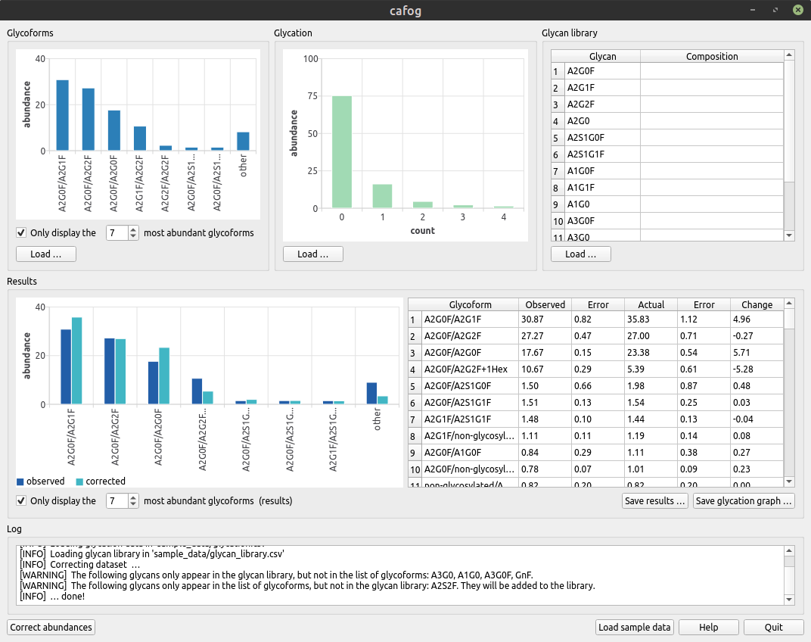
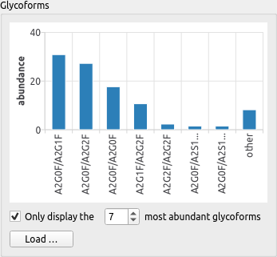
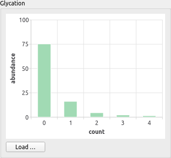
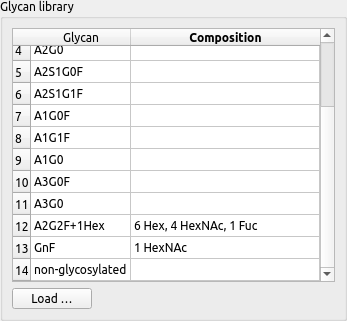
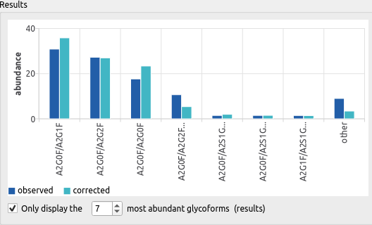
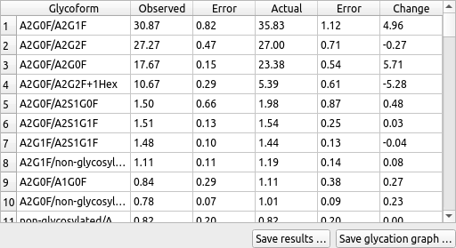
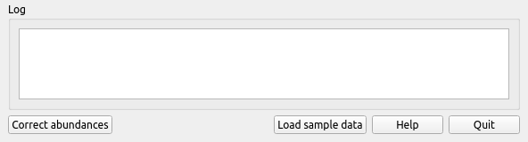

************************************
cafog_gui - Graphical user interface
************************************

========
Overview
========

The layout of cafog's main window encourages a **workflow** that comprises four steps:

1. Load *glycoform* abundances.
2. Load *glycation* abundances.
3. Provide a *glycan library* (optional).
4. Perform the *correction* and evaluate the results.

============================
1. Load glycoform abundances
============================

Load a dataset from an RFC 4180-compliant **CSV file** by dragging it into the white area or by selecting it after clicking *Load*.

* The CSV file must contain three columns containing glycoform names, abundances, and experimental errors of abundances, respectively.
* A header is not allowed, but any line starting with ``#`` will be discarded.
* Format for glycoform names: ``glycan 1/glycan 2/…/glycan n``.
* The monosaccharide composition for glycans whose name follows the Zhang nomenclature will be deduced automatically. The composition for other glycans must be provided in the glycan library.

The contents of the CSV file are displayed as a **bar chart**.

* Draw a rubberband while pressing the left mouse button to zoom.
* Right click to reset zoom.
* If the checkbox is active, only abundances for the most abundant glycoforms (default: seven) will be shown. Abundances of the remaining ones will be summed and shown as 'other'.

============================
2. Load glycation abundances
============================

Load a dataset from an RFC 4180-compliant **CSV file** by dragging it into the white area or by selecting it after clicking *Load*.

* The CSV file must contain three columns containing glycation counts, abundances, and experimental errors of abundances, respectively.
* A header is not allowed, but any line starting with ``#`` will be discarded.

===========================
3. Provide a glycan library
===========================

Load a dataset from an RFC 4180-compliant **CSV file** by dragging it into the white area or by selecting it after clicking *Load*.

* The CSV file must contain two columns containing glycan names and monosaccharide compositions, respectively.
* A header is not allowed, but any line starting with ``#`` will be discarded.
* Monosaccharide compositions should be specified like ``1 Hex, 2 HexNAc, 3 Fuc``.
* Monosaccharide compositions may be empty if the glycan name adheres to the Zhang nomenclature.

A glycan library is **only required if** glycoforms

* have names that do not adhere to the Zhang nomenclature. In this case, the monosaccharide composition must be specified.
* do not contain all glycans that should be used for calculating corrected abundances.

==================================================
4. Perform the correction and evaluate the results
==================================================

Click *Correct abundances* after you have at least loaded glycoform and glycation data (steps 1 and 2).

The **bar chart** shows glycoform abundances before and after correction for influences of glycation.

* Draw a rubberband while pressing the left mouse button to zoom.
* Right click to reset zoom.
* If the checkbox is active, only abundances for the most abundant glycoforms (default: seven) will be shown. Abundances of the remaining ones will be summed and shown as 'other'.

The **table lists** detailed glycoform abundances, along with their experimental errors, before and after correction for influences of glycation. "Change" denotes the difference between actual and observed abundance.

*Save results* saves either the results chart (in PNG or SVG format) or the results table (in CSV format).

*Save glycation graph* saves the glycation graph that was assembled for correcting abundances, either in GraphViz DOT or graph exchange XML format (GEXF).

==================
Other GUI elements
==================

* *Log* contains the log of the current session.
* *Load sample data* opens an exemplary input dataset (glycoforms, glycation, glycation library). 
* *Help* displays this document
* *Quit* closes the application.
